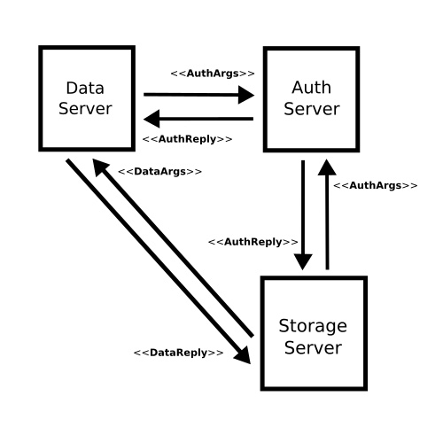

# Duyog

A music streaming server implementation.


# Install
```bash
$ go get github.com/mownier/duyog
```

# Dependency
```bash
$ go get github.com/gorilla/mux
$ go get github.com/gorilla/rpc
$ go get github.com/gorilla/context
$ go get github.com/dgrijalva/jwt-go
$ go get github.com/garyburd/redigo
$ go get github.com/rs/xid
```

# Arthictecture

There are three servers `auth`, `data`, and `storage`. The `auth` server is responsible for accessing user credentials, client information, and tokens. The `data` server is responsible for accessing album, artist, playlist, song, and user information. The `storage` server is responsible for accessing files such as audio and images.



Data server verifies the access token by using a microservice provided by the auth server. Storage server verifies first the access token and then, verifies album, artist, playlist, song, and user by using a microservice provided by the data server.

User must sign in/sign up first via the auth server to acquire an access token. This access token will be used to consume the public resources/services provided by the data and storage servers.

If the access token provided by the user is issued by a client who has an admin role, the user can upload audio and create songs, artists, and albums. Otherwise the user is forbbiden to use those resources/services.

# License
MIT License

